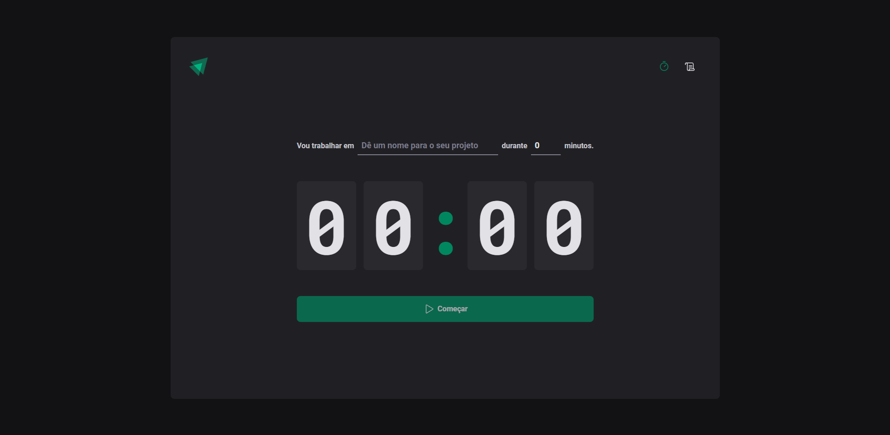
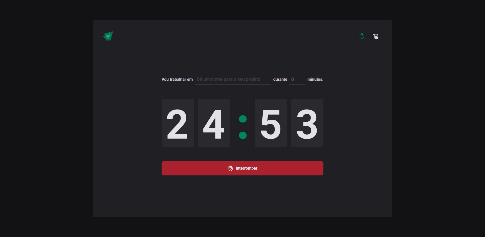
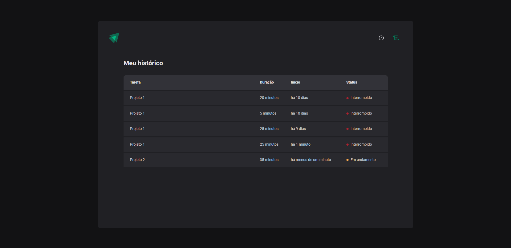

## Projeto Ignite Timer
Projeto criado para aprender conceitos importantes do React como ContextAPI, useReducer, Immer, etc

### 🛠️ Nesse projeto foi utilizado

* Vite
* Styled Components
* Zod
* Immer
* React Hook Form
* React Router Dom
* TypeScript

## 🚀 Como executar

**Para que esse projeto funcione corretamente, é preciso estar com o servidor rodando.**

- Instale os pacotes com `npm install ou yarn`.
- Execute `npm run dev ou yarn dev` para iniciar o cliente web.

## 🖼 Imagens do projeto:

